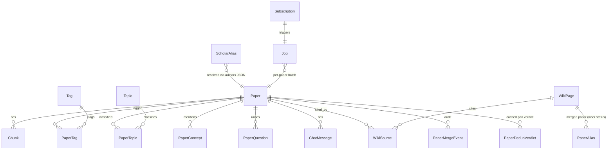

# Data model and schemas

Carrel uses SQLModel (SQLAlchemy + Pydantic) against PostgreSQL 16 with the
`vector` extension. All tables are created on startup by `init_db` (no Alembic
migrations yet); additive column changes are applied via idempotent
`_ensure_columns` calls. Tests run against in-memory SQLite where
`Vector(2048)` and `HALFVEC(2048)` are swapped for `JSON` columns
(`carrel/models.py:20-27`).

## Enums

### `PaperStatus` (`carrel/models.py:33-43`)
`pending` → `pdf_ready` → `parsed` → `summarized` → `ready`, with terminal
`failed` and the dedup-only `merged`. Transitions:

- `pending` — metadata only, awaiting processing.
- `pdf_ready` — PDF downloaded (`paper.pdf_path` set).
- `parsed` — MinerU produced `paper.md` (`paper.md_path` set).
- `summarized` — LLM filled at least one of `tldr_en`/`tldr_zh`/
  `summary_zh`/`keywords`. Best-effort; papers can skip straight from
  `parsed` to `ready` if no LLM key is configured.
- `ready` — chunked and embedded. Search/chat require this state.
- `failed` — a download/parse/embed attempt set `paper.error`.
- `merged` — set by paper-dedup when the row is a loser absorbed via
  `paper_aliases`; user state is migrated off the row and the canonical id is
  resolved through `resolve_paper_id`.

### `JobStatus` (`carrel/models.py:93-97`)
`queued` → `running` → `done` | `failed`. On startup the lifespan runs
`UPDATE jobs SET status='failed', ... WHERE status IN ('queued','running')`
(`carrel/main.py:91-97`) so a crashed process does not leave the UI polling
forever.

### `JobKind` (`carrel/models.py:59-84`)
`sync`, `download`, `parse` (reserved), `summarize`, `topics`,
`authors_backfill`, `embed`, `citations`, `remote_fill`,
`publication_check`, `wiki_compile`, `wiki_recompile`, `scholar_dedup`,
`paper_dedup`, `paper_extract`. The per-paper batch endpoints use
`download`, `summarize`, `topics`, `embed`, `paper_extract`.

### Other enums
- `OAStatus` — `oa`, `closed`, `none`, `institutional`.
- `SourceKind` — `arxiv`, `openalex`, `both`.
- `WikiKind` — `concept`, `scholar`, `question`.

## Tables

### `papers`
Primary key is the **OpenAlex Work ID** (`W2741809807`) when known; otherwise
`arxiv:<bare-id>`. The same paper may later be promoted to an OpenAlex id at
sync time if the placeholder is still fresh (see
[../ingestion/sync.md](../ingestion/sync.md)). Cross-id duplicates that are
not safe to promote are linked via `paper_aliases` instead.

Key column groups:

- **Identity / metadata**: `id`, `id_kind`, `title`, `abstract`,
  `publication_date`, `venue`, `doi`, `arxiv_id`, `s2_paper_id`, `authors`
  (JSON: `[{name, openalex_author_id, affiliation}]`), `raw_meta` (the
  original OpenAlex work or arXiv feed entry).
- **PDF / parse**: `pdf_url`, `pdf_path`, `md_path`, `oa_status`, `source`,
  `pdf_origin` (`oa|arxiv|institutional|journal`), `journal_doi`,
  `pdf_files` (JSON map of named variants, e.g. `{"arxiv":..., "journal":...}`),
  `published_checked_at`.
- **State**: `status`, `error`, `in_library`, `discarded`, `discovered_at`,
  `created_at`, `updated_at`.
- **User state**: `favorite`, `notes_markdown`, `tags` (via `paper_tags`),
  `topics` (via `paper_topics`), chat history (`chat_messages`).
- **AI outputs**: `tldr_en`, `tldr_zh`, `summary_zh`, `keywords` (JSON).
- **Citations**: `citation_count`, `influential_citation_count`,
  `reference_count`, `citing_papers` (JSON, capped list), `references`
  (JSON, same shape), `citations_updated_at`.

### `chunks`
One row per heading-aware slice of a parsed paper. `embedding` is a pgvector
`vector(2048)` column (sequential scan by default; an HNSW cosine index
`ix_chunks_embedding_hnsw` is best-effort created at startup and
transparently skipped on pgvector versions that cap `vector` at 2000 dims).
SQLite stores the same list as JSON for tests.

### `subscriptions`
`(kind, value)` unique. `kind ∈ {keyword, author, venue, arxiv_category}`.
Author/venue values are OpenAlex IDs; keywords/arxiv categories are free-text.
A curated one-click set (Nature/Cell/Science) lives in
`carrel/api/subscriptions.py:TOP_JOURNALS`.

### `tags`, `paper_tags`, `topics`, `paper_topics`
- `tags.name` is unique (enforced case-insensitively at the API layer via
  `_get_or_create_tag`, which looks up existing tags by ILIKE and reuses the
  first-seen casing).
- `topics.name` is unique; the LLM classifier is told to reuse existing topic
  names verbatim.
- Both association tables use a composite primary key and a reverse index on
  the tag/topic side.

### `paper_concepts`, `paper_questions`
Compound PK by `(paper_id, term_normalized)` / `(paper_id, question_normalized)`.
Each carries the LLM-extracted `term_display` / `question_display`, a
`evidence_quote` (a verbatim span from the paper, verified before write —
hallucinated spans are dropped), and a `category` on concepts (METHOD /
THEORY / DATASET / DOMAIN / PHENOMENON; nullable for rows predating the
column). These are the input feed for the concept/question wiki compilers.

### `chat_messages`
One row per RAG chat turn. Whole-document PUT semantics — the client replaces
the full transcript per paper (`PUT /papers/{id}/chat/messages`), mirroring
notes. Ordered by `id`.

### `wiki_pages`
The disk-backed wiki's SQL index. **Markdown files under
`data/wiki/{concepts,scholars,questions}/` are the source of truth**; this row
is a cache that can be rebuilt from disk by `reindex_wiki`. Columns:

- Identity: `kind`, `slug` (unique together), `title`, `entity_key`
  (stable kind-qualified identity, e.g. `scholar:A5002874269` or
  `scholar:name:he-li`), `redirects_to`.
- Scholar/question specifics: `scholar_aid`, `question_status`
  (`open|contested|partially_solved|resolved`; v1 always writes `open`).
- File / provenance: `path` (storage-root-relative), `checksum` (sha256),
  `source_paper_ids` (JSON).
- Mirrored frontmatter for list views without file IO: `summary`, `tags`,
  `links_out`, `links_in_count`, `confidence`, `evidence_count`, `stub`.
- `embedding` is `halfvec(2048)` with a best-effort HNSW cosine index (works
  on pgvector ≥ 0.7; the 2048-dim model exceeds the 2000-dim cap of the
  regular `vector` opclass).

A partial unique index `uq_wiki_pages_entity_key_live` enforces one live page
per `entity_key`; redirect shells share their canonical's key and are
excluded by the `WHERE redirects_to IS NULL` predicate.

### `wiki_sources`
Assertion-level provenance: each row links a wiki page to the paper (and, for
concept/question pages, the chunk) whose evidence backs it. `heading` and
`quote` pin the claim; `role` is `context|support|contradict` (question
pages use the latter two). `ON DELETE CASCADE` on both foreign keys means
deleting a paper or a wiki page cleans up its provenance automatically.

### `scholar_aliases`
Maps a duplicate OpenAlex Author ID (`alias_aid`) to its canonical AID.
`source ∈ {auto, user, reject}` — a `reject` row suppresses future
auto-suggestions and is never followed. `confidence`, `reasons`, and `note`
record the scoring rationale. `Paper.authors` is never rewritten; the
aggregator in `_scholars_agg.author_key` resolves every A-ID through this
table at read time, so a merge is reversible by deleting the alias row.

### `paper_aliases`, `paper_merge_events`, `paper_dedup_verdicts`
The paper-dedup indirection layer. `paper_aliases` mirrors
`scholar_aliases` at the paper level with an additional `llm` source for the
LLM judge. `paper_merge_events` is an append-only audit row capturing the
loser paper's pre-merge user-state snapshot (favorite, notes, tags, topics,
chat history, chunks, wiki_sources, citation lists, tldr/summary/keywords).
`paper_dedup_verdicts` caches each LLM judge call keyed by
`(paper_a_id, paper_b_id, prompt_hash)`; bump
`cfg.llm.paper_dedup_judge_prompt_version` to invalidate.

### `jobs`
Generic background-job record used by every batch endpoint and every
scheduled sweep. `kind` ∈ `JobKind`, `status` ∈ `JobStatus`, `message` is a
short human-readable line, `stats` is arbitrary JSON (the frontend reads
`stats.stage`, `stats.detail`, `stats.paper_id`, and per-run counters).
There is no priority or queue — jobs are run inline or via
`BackgroundTasks` in FIFO order as they are created.

## Indexes created at startup

In addition to the single-column `index=True` fields declared on the models,
`init_db` creates:

- `ix_chunks_embedding_hnsw` (HNSW cosine on `chunks.embedding`; best-effort).
- `ix_wiki_pages_embedding_hnsw` (HNSW cosine on `wiki_pages.embedding`
  using the `halfvec_cosine_ops` opclass; best-effort).
- `uq_wiki_pages_entity_key_live` (partial unique index over live pages).
- `ix_scholar_aliases_alias_canon` (unique alias pair).
- `ix_paper_aliases_pair` (unique alias pair).
- `ix_paper_dedup_verdicts_pair` (verdict lookup pair).
- `ix_paper_merge_events_pair` (audit lookup pair).
- `ix_paper_tags_tag_id`, `ix_paper_topics_topic_id` (reverse lookups).
- `ix_subscriptions_kind_value` (unique subscription).
- `ix_wiki_pages_kind_slug` (unique catalog address).
- `ix_wiki_sources_page_paper` (provenance lookup).
- `ix_wiki_pages_redirects_to` (redirect resolution).

## Pydantic API schemas

`carrel/schemas.py` defines the request/response shapes separate from the
ORM models. The most-used ones:

- `PaperSummary` (cards/lists) vs `PaperDetail` (single-paper view, adds
  abstract, ids, paths, error, author_list, citation timestamps, pdf_files,
  journal_doi, notes).
- `HealthResponse`, `JobOut`, `SearchResponse`/`SearchResultItem`,
  `SemanticSearchResponse`/`SemanticSearchResult`,
  `ScholarSummary`/`ScholarDetail`/`ScholarWorkOut`,
  `WikiPageSummary`/`WikiPageDetail`/`WikiSourceOut`/`WikiBacklink`,
  `CitationListOut`/`ReferenceListOut`, `TopicWithCount`, `TagWithCount`,
  `SubscriptionIn/Out`, `SchedulerStatus`/`SchedulerUpdate`.

Batch endpoints share a common request shape (`paper_id?`, `limit?`,
`background?`, `force?`) used by `ProcessRequest`, `SummarizeRequest`,
`TopicsRequest`, `EmbedRequest`, `AuthorsBackfillRequest`, and
`PaperExtractRequest`.

## Evidence

- Full table/enum definitions: `carrel/models.py`.
- Engine, extension registration, additive migrations, HNSW indexes, wiki
  identity backfill/retirement: `carrel/db.py` (see
<!-- openwiki: broken internal link [database.md] file "database.md" does not exist. Fix the href or restore the target, then delete this comment. -->
  [database.md](database.md)).
- API schemas: `carrel/schemas.py`.
- Paper state transitions: `carrel/pipeline/process.py`,
  `carrel/pipeline/summarize.py`, `carrel/pipeline/embed.py`.
- Alias behavior: `carrel/pipeline/paper_dedup_ops.py`,
  `carrel/pipeline/scholar_dedup.py`,
  `carrel/pipeline/wiki/_scholars_agg.py`.
- SQLite test fallback: `tests/conftest.py`.
