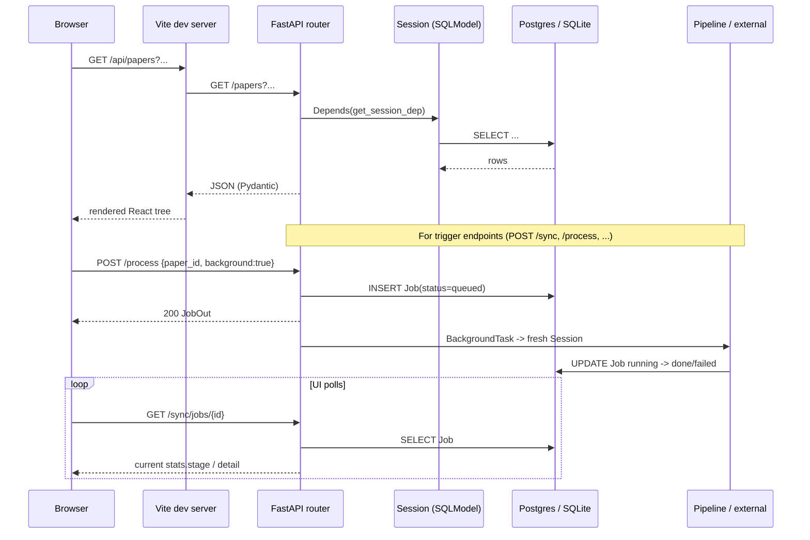

# Carrel architecture overview

Carrel is a self-hosted, single-user paper reading room. The user runs three
processes on one machine:

1. A **PostgreSQL 16 + pgvector** container (`docker-compose.yml`) holding all
   metadata, chunks/embeddings, jobs, alias tables, and wiki index.
2. A **FastAPI** backend (`carrel/main:app`, served by uvicorn on
   `127.0.0.1:8787`) that owns every HTTP route, every pipeline, and the
   in-process APScheduler.
3. A **Vite + React + TypeScript** dev server (`frontend/`, `127.0.0.1:5173`)
   that proxies `/api/*` and `/storage/*` to the backend.

PDF parsing is delegated to a fourth, optional process: a self-hosted
**MinerU** HTTP API on `127.0.0.1:8000` (native venv on CPU/Apple Silicon via
`make mineru-up`, or the NVIDIA-GPU Docker image under the `mineru` compose
profile). MinerU is invoked strictly over HTTP so its AGPL-3.0 license does
not propagate to Carrel.

<!-- openwiki: mermaid parse failed and this diagram was converted to a text fence so it does not break rendering. Fix the diagram source and restore the mermaid fence. Parser error: Heuristic: an unescaped angle bracket inside a label breaks rendering; rephrase the label. -->
```text
flowchart LR
    subgraph Browser
      UI[React + Vite<br/>pages + components]
    end
    subgraph Backend["FastAPI (carrel/main.py)"]
      R[API routers<br/>carrel/api/*]
      P[Pipelines<br/>carrel/pipeline/*]
      SCH[APScheduler<br/>carrel/scheduler.py]
      LLM[llm.py + embeddings.py<br/>litellm]
    end
    PG[(Postgres 16 + pgvector)]
    FS[("data/<br/>papers/, wiki/, attachments/")]
    ARX[arXiv Atom API]
    OA[OpenAlex via pyalex]
    S2[Semantic Scholar Graph API]
    MIN[MinerU HTTP API]
    SSH[Institutional SSH jump host<br/>optional]

    UI -- "/api -> http://127.0.0.1:8787" --> R
    UI -- "/storage" --> FS
    R --> P
    SCH --> P
    P --> PG
    P --> FS
    P --> ARX
    P --> OA
    P --> S2
    P --> MIN
    P --> SSH
    P --> LLM
    R --> PG
```

## Process and threading model

The backend is one uvicorn process. Inside it:

- **Request handlers** run on FastAPI/Starlette's threadpool for the (many)
  sync `def` endpoints, or on the event loop for the few `async def` routes
  (notably the SSE chat endpoint in `carrel/api/chat.py`).
- **Scheduled jobs** run on APScheduler's `BackgroundScheduler` thread pool
  (`carrel/scheduler.py`). A module-level `_in_flight` set plus a lock guards
  manual "Run now" clicks so a double-click cannot start two concurrent passes
  of the same job; APScheduler's own `max_instances=1` handles the scheduled
  case.
- **Background API jobs** (`POST /sync`, `/process`, `/embed`, `/summarize`,
  `/topics`, `/authors-backfill`, `/paper-dedup/run`, `/scholar-dedup/run`,
  `/papers/extract`, `/papers/{id}/check-publication`, `/wiki/compile`,
  `/papers/{id}/refresh-citations`) use FastAPI `BackgroundTasks`. Each
  creates a `Job` row first, returns it to the UI, and then runs the pipeline
  in a fresh SQLModel session opened against the app engine. The frontend
  polls `GET /sync/jobs/{id}` (or the per-domain job list) and renders stage
  text from `job.stats`.
- **Long LLM / embedding calls** go through `litellm`, which is synchronous.
  The chat endpoint is the one place that streams — it is an `async def`
  route that iterates litellm's streaming completion and yields SSE frames
  while the rest of the app keeps serving.

The frontend is a SPA built with React Router. Every backend call goes through
`frontend/src/api/client.ts`, which prefixes `/api`; Vite rewrites that prefix
away when proxying to the backend (`frontend/vite.config.ts`). Parsed paper
images are served by FastAPI's `StaticFiles` mount at `/storage`
(`carrel/main.py` mounts `cfg.storage.root` last so it never shadows API
routes).

## Request lifecycle



## Startup sequence

`create_app()` builds the FastAPI instance and CORS middleware from a
*build-time* config load (so CORS origins are correct even before lifespan
runs). `lifespan()` then:

1. `_bootstrap_config()` loads `data/config.yaml`, merges `.env` overrides,
   and creates every storage directory (`papers/`, `attachments/`,
   `wiki/{concepts,scholars,questions}/`).
2. `init_app_engine(env)` builds the SQLAlchemy engine; `init_db(engine)`
   creates the pgvector extension, runs `SQLModel.metadata.create_all`,
   applies additive column migrations via `_ensure_columns`, backfills
   defaults, runs wiki-identity reconciliation, and best-effort-creates the
   HNSW indexes on `chunks.embedding` and `wiki_pages.embedding`.
3. Orphan jobs left `queued`/`running` by a previous crash are flipped to
   `failed` with `"Interrupted by server restart"` so the UI stops polling.
4. Shared HTTP clients for Semantic Scholar and OpenAlex are configured once
   (`s2.configure(...)`, `oa.configure(cfg)`).
5. `start_scheduler(cfg)` registers every `JOB_SPECS` whose `enabled_attr`
   is true and arms its cron trigger.

On shutdown, `stop_scheduler()` shuts down APScheduler. There is no explicit
connection-pool teardown beyond SQLAlchemy's defaults.

## Cross-cutting invariants

- **Synchronous pipelines.** Every module under `carrel/pipeline/` is
  intentionally synchronous. A single-user daily sync processes tens to
  hundreds of papers; adding Celery/RQ would be disproportionate, and keeping
  the pipelines synchronous makes the Job row + progress callback pattern
  trivial to reason about.
- **One Job row per run, one Job row per per-paper batch item.** A batch
  endpoint like `POST /process` creates one `Job` per target paper; a
  scheduled sweep or `/wiki/compile` creates one Job for the whole pass and
  reports progress in `job.stats`.
- **Idempotency first.** Download skips when `paper.pdf` exists, parse skips
  when `paper.md` exists, embed skips when chunks exist and the paper is
  `ready`, summarize fills only missing fields, topics skips papers that
  already have topics, and wiki compilers hash their inputs to skip
  up-to-date pages.
- **Non-fatal enrichment.** Summarize, topics, paper_extract, citation
  enrichment, and author backfill never flip a paper to `failed`. Only
  download/parse/embed failures set `Paper.error` + `status=failed`; even
  then a manual retry simply calls the pipeline function again.
- **Per-source error isolation.** A 429 from arXiv or a 500 from OpenAlex
  during sync is captured in `run_sync`'s `errors` dict; the other sources
  and the upsert still run.
- **Single-user, no auth.** There is no user table. "User state" means
  favorites, notes, tags, chat history, and `in_library`/`discarded` flags on
  `Paper` itself.

## Evidence

- Application factory, lifespan, router mount order, `/storage` mount:
  `carrel/main.py`.
- Database bootstrap, migrations, indexes: `carrel/db.py` (see
<!-- openwiki: broken internal link [database.md] file "database.md" does not exist. Fix the href or restore the target, then delete this comment. -->
  [database.md](database.md)).
- Scheduler and jobs: `carrel/scheduler.py` (see
  [scheduler-and-jobs.md](scheduler-and-jobs.md)).
- All tables and enums: `carrel/models.py` (see
  [data-model.md](data-model.md)).
- Runtime dependencies: `pyproject.toml`.
- External services: `docker-compose.yml`, `Makefile`,
  `carrel/sources/*.py`.
- Frontend proxy/routing: `frontend/vite.config.ts`, `frontend/src/App.tsx`
  (see [../frontend/overview.md](../frontend/overview.md)).
- Original engineering blueprint (Chinese, predates several milestones):
  `docs/architecture.md`.
