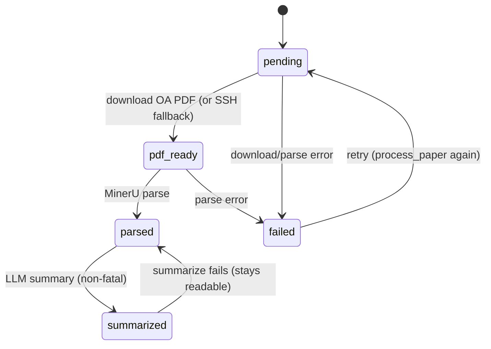

# PDF download and MinerU parsing

`carrel/pipeline/process.py` drives a paper through
`pending → pdf_ready → parsed`, with a best-effort chained LLM summary.
The state machine is per-paper, synchronous, and idempotent at every
step; the API layer wraps each paper in its own `Job` row for progress
reporting.

## Paths and filenames

`paper_paths(paper, cfg)` returns `(work_dir, pdf_dest, md_dest,
rel_prefix)` where:

- `work_dir = <storage.root>/<papers_subdir>/<safe-slug>` created by
  `safe_paper_dir` (the `:`, `/` in `arxiv:<id>` are replaced with `_`,
  so the directory is portable across filesystems).
- `PDF_FILENAME = "paper.pdf"`, `MD_FILENAME = "paper.md"`.
- `rel_prefix` is the storage-root-relative prefix stored on
  `Paper.pdf_path` / `Paper.md_path` (e.g. `papers/W12345`).

MinerU writes the markdown and an `images/` directory into `work_dir`.
The frontend resolves image links against the `/storage` static mount
(see [../frontend/overview.md](../frontend/overview.md)).

## PDF download chain

`_step_download` works through an ordered list of candidates built by
`_pdf_candidates(paper)`:

1. `paper.pdf_url` (the stored best-OA URL).
2. Every URL returned by `openalex_client.work_pdf_candidates(raw_meta)`
   (repository/arXiv copies OpenAlex lists alongside the publisher URL).
3. `https://arxiv.org/pdf/<arxiv_id>.pdf` as a last resort.

`download_pdf_with_fallback` (in `carrel/sources/pdf_download.py`) tries
each URL in order:

- HTTP GET with `follow_redirects=True`, a custom `User-Agent`, and a
  size cap (`cfg.download.max_bytes`, default 80 MiB). Only **2xx**
  responses are accepted; redirects are followed but a 4xx/5xx falls
  through to the next candidate.
- Validates by content-type (`application/pdf` is preferred; any
  `text/html` response is rejected as a landing page) **and** the
  `%PDF-` magic bytes (`looks_like_pdf`) so an HTML page that slips
  past content-type is still rejected.
- Writes to a temp file (`.part`-style) and atomically renames to
  `paper.pdf` so a failed download never leaves a half-written file.
- Raises `DownloadError` only after every candidate fails (the message
  lists each attempt).

When a later candidate (an arXiv/repository PDF) succeeds where the
stored publisher `paper.pdf_url` served HTML, `_step_download`
**rewrites `paper.pdf_url` to the working URL** and records
`pdf_origin` as `"arxiv"` (for the synthesized arXiv PDF) or `"oa"`
(for an OpenAlex repository copy); `oa_status` is set to `"oa"`.
The earlier failed URL is discarded so the next retry starts from the
known-good one.

### Idempotency gates

`_step_download` and `_step_parse` both short-circuit on disk state:
if `pdf_dest.exists()` the download is skipped (the existing
`paper.pdf` is reused), and if `md_dest.exists()` the MinerU call is
skipped. This makes `process_paper` safe to re-invoke after a partial
failure — only the missing stage runs.

### Institutional SSH fallback

If every HTTP candidate fails (or there is no PDF URL at all),
`_try_remote_download` invokes `carrel/sources/remote_downloader.py`:

- Gated on `remote_ssh_enabled` and `is_configured()` (paramiko must
  import and `.env` must supply host/user/key path/work dir/command
  template — nothing is hardcoded).
- Identifier precedence: `journal_doi` → `doi` (doi.org prefix stripped)
  → version-stripped arXiv id. The id is whitelist-validated before
  substitution into the command template
  (`{id}`, `{work_dir}`, `{timeout}` are the only placeholders).
- The remote CLI (e.g. `scansci-pdf`) is expected to print
  `OK: <remote-path>.pdf`; the file is then SFTP'd back and validated
  with the same `%PDF-` magic.
- On success `oa_status='institutional'`, `pdf_origin='institutional'`,
  status becomes `pdf_ready`.
- Error taxonomy: `RemotePermanentError` is raised for a deterministic
  failure (invalid identifier, remote CLI returned a non-`OK:` line,
  SFTP reported no such file) and is wrapped into `ProcessError`
  without retry; a transient `RemoteError` (SSH connection drop,
  timeout) is retried by `remote_downloader` up to `remote_retries`
  before bubbling up.

This is a fallback only; open-access HTTP is always tried first.

## MinerU parse

`_step_parse` calls `mineru_client.parse_pdf(pdf_path, work_dir, ...)`.
Carrel talks to a self-hosted `mineru-api` FastAPI service over HTTP and
never imports MinerU code (its AGPL license stays isolated in a separate
process). The client uses MinerU's async task API:

1. `POST /tasks` with the PDF and parse options
   (`backend`, `parse_method`, `lang_list`, `formula_enable`,
   `table_enable` from `cfg.mineru`), receiving a `task_id`.
2. Poll `GET /tasks/{id}` (progress callback emits
   `("status", {"status": ..., "queued_ahead": n})`).
3. `GET /tasks/{id}/result` streams back a ZIP containing
   `<name>.md` plus an `images/` directory.

The ZIP form (rather than JSON with base64 images) keeps large image
payloads out of memory. `parse_pdf` writes `paper.md` and extracts
images into the work dir, returning a `MinerUResult`. If MinerU is
unreachable or returns a non-2xx / ZIP missing the markdown, it raises
`MinerUError`.

`is_healthy(base_url)` is used by `/health` to report MinerU status.

## Chained summary

After a successful parse, `process_paper` imports and calls
`summarize_paper` best-effort (see
[../enrichment/summarization.md](../enrichment/summarization.md)). A
missing API key or LLM error is caught as `SummarizeError`; the paper
stays `parsed` (embedding still accepts it), and `paper.error` is not
overwritten so a successful parse is not obscured.

## Status and errors

- `paper.error` is cleared at the start of each `process_paper` call so
  a retry reflects the fresh attempt.
- Download/parse failures set `status='failed'` and `error` to the
  message; the Job row is marked failed. A manual retry simply calls
  `process_paper` again — existing `paper.pdf` / `paper.md` are reused
  (idempotent skips).
- `select_pending(session, limit)` returns `pending` and `failed` papers
  without a `pdf_path` for batch processing.

## API: `POST /process`

`carrel/api/process.py` accepts `{paper_id?, limit, background}`:

- A specific `paper_id` processes one paper; otherwise `select_pending`
  returns the backlog.
- One `Job(kind='download')` row is created **per paper** (a 10-paper
  batch creates 10 jobs), each with `stats.paper_id` /
  `stats.paper_title` / `stats.stage` / `stats.detail`.
- `background=true` (default) runs via FastAPI `BackgroundTasks` in a
  fresh DB session; the response returns queued jobs the frontend polls
  via `GET /sync/jobs`. The `_make_progress_cb` closure persists live
  stage/detail text to the Job row on every progress callback.
- `background=false` runs inline and returns finished jobs.

## Flow



## Focused tests

- `tests/test_pdf_download.py` — magic-byte validation, HTML rejection,
  size cap, atomic rename, fallback ordering.
- `tests/test_mineru_client.py` — task submit/poll/result ZIP handling,
  health check, error propagation (httpx mocked).
- `tests/test_remote_downloader.py` — whitelist id validation, command
  template substitution, SFTP pull, magic-byte check, paramiko-absent
  degradation.
- `tests/test_process.py` — full state machine, idempotent skips,
  candidate URL ordering, institutional fallback, non-fatal summary.
- `tests/test_process_api.py` — Job creation per paper, inline vs
  background execution, progress callback persistence.

## Validation

```bash
.venv/bin/python -m pytest tests/test_pdf_download.py tests/test_mineru_client.py tests/test_remote_downloader.py tests/test_process.py tests/test_process_api.py -q
```

Live end-to-end (requires MinerU running on :8000):

```bash
curl -s -X POST http://127.0.0.1:8787/process \
  -H 'content-type: application/json' \
  -d '{"paper_id":"<id>","background":false}' | jq
```

## Evidence

- Pipeline: `carrel/pipeline/process.py`.
- Downloader: `carrel/sources/pdf_download.py`.
- MinerU client: `carrel/sources/mineru_client.py`.
- Institutional SSH: `carrel/sources/remote_downloader.py`; config in
  `EnvSettings` ([../architecture/configuration.md](../architecture/configuration.md)).
- API: `carrel/api/process.py`.
- MinerU deployment: `Makefile` (`mineru-install`, `mineru-up`),
  `docker-compose.yml` (`mineru` profile).
- Next step: [../enrichment/embeddings.md](../enrichment/embeddings.md)
  (`parsed → ready`).
