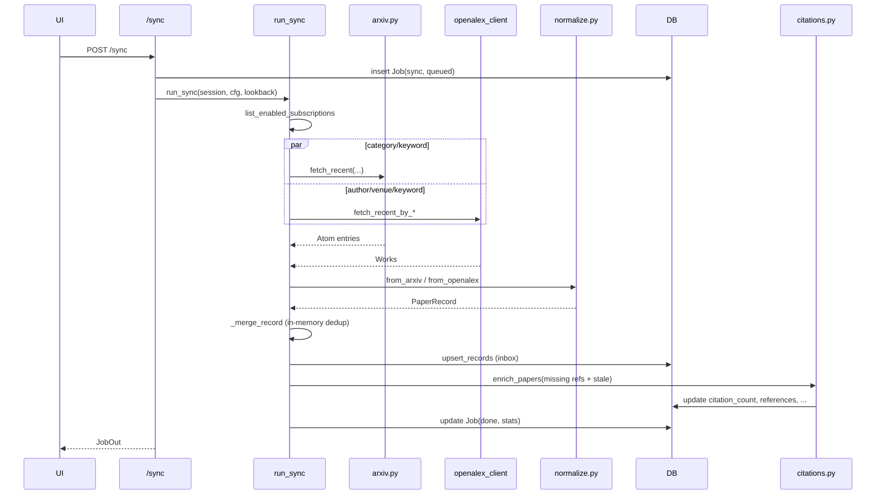

# Sync pipeline

`carrel/pipeline/runner.py` is the orchestration entry point invoked by
`POST /sync` (inline or background) and by the APScheduler
`daily_sync` job. It is intentionally synchronous: a single-user daily sync
is tens to hundreds of papers, and MinerU/LLM calls run elsewhere.

## Subscriptions

The `subscriptions` table holds four kinds, partitioned by
`partition_subscriptions`:

- `keyword` — searched against **both** arXiv and OpenAlex (keywords are
  intentionally not restricted to subscribed arXiv categories).
- `arxiv_category` — arXiv category sweep only.
- `author` — OpenAlex author-id recent works.
- `venue` — OpenAlex source-id recent works.

Subscriptions are stored in the DB (managed through
`POST/GET/DELETE /subscriptions`) and may also be seeded from the
`subscriptions:` list in `config.yaml` on first boot (see
[../architecture/configuration.md](../architecture/configuration.md)).
Only rows with `enabled=True` are considered.

## Fetch (`fetch_candidates`)

For one sync pass:

1. Configure OpenAlex from `cfg` (`oa.configure(cfg)` sets mailto, api_key,
   timeout, retries).
2. Compute `since = now - lookback_hours`. The scheduler passes 26h by
   default so a delayed/skipped run still sweeps.
3. Run each source in isolation so a 429/503 from one never aborts the
   others. Per-source exceptions are caught and recorded as strings in an
   `errors` dict keyed by source/subscription (`arxiv_categories`,
   `arxiv_keywords`, `openalex_author:<id>`, `openalex_venue:<id>`,
   `openalex_keyword:<q>`).
4. Each raw entry is normalized to `PaperRecord` via
   `carrel/sources/normalize.py`:
   - arXiv entries go through `from_arxiv` then `enrich_with_openalex`
     (best-effort lookup that attaches an OpenAlex W-id when found).
   - OpenAlex works go through `from_openalex`, which filters Zenodo
     deposits and skips records with no title.
5. `_merge_record` collapses duplicate records in memory. The key is the
   canonical id; when an OpenAlex record carries an arXiv id it evicts
   any earlier `arxiv:<id>` placeholder. Collisions between two records
   with the same id resolve through `_is_stronger`
   (openalex > arxiv, then venue > doi > abstract).

## Identity and authors at sync time

`Paper.id` (`carrel/models.py`) is the OpenAlex Work ID (`W...`) when one
is known; the fallback is `arxiv:<bare-id>`. S2-only papers get
`s2:<paperId>` via the Search/import path, never via sync — sync itself
only fans out to arXiv and OpenAlex (Semantic Scholar enters later, for
citation enrichment).

**Authors are not merged at sync time.** `PaperRecord.authors` is a list
of `{name, openalex_author_id, affiliation}` dicts. arXiv entries are
born with empty A-IDs (`normalize.from_arxiv`); OpenAlex entries carry
A-IDs from `oa.work_authors`. On insert the list is stored wholesale; on
refresh the list is **not touched** (see below). Cross-source A-ID
unification, name canonicalization, and same-person clustering happen
later, in [../enrichment/authors-backfill.md](../enrichment/authors-backfill.md)
(`pipeline/authors.py::_merge_authors`, which fills missing A-IDs by
position and never overwrites an existing one) and
[../dedup/scholar-dedup.md](../dedup/scholar-dedup.md). There is no
Author table — authors live only on the `Paper.authors` JSON column.

**There is no `source_links` array.** Where a paper came from is tracked
two ways: (a) the `source` column on `Paper`, a tri-value enum
`arxiv | openalex | both`; and (b) the identifier columns themselves
(`doi`, `arxiv_id`, `s2_paper_id`, `id_kind`, plus `journal_doi` as the
published-version bridge for an arXiv row). At search-result-merge time
(`carrel/sources/merge.py::merge_search_hits`, used by `GET /search`),
the per-source set `MutableSearchHit.sources` is unioned with `|=` (a
set, so no duplicates) and every identifier is unioned; at sync time
the upsert uses a stricter "fill only when empty" rule described below.

## Upsert (`upsert_records`)

Sync never inserts directly into the library. Every new record is written
with `in_library=False`, `discarded=False`, `status=pending`, and
`discovered_at=now`. The user imports explicitly via
`POST /papers/{id}/import` (see
[../backend/papers-and-library.md](../backend/papers-and-library.md)).

For each record:

1. **Placeholder promotion.** If the primary key misses but the incoming
   record is an OpenAlex work with an arXiv id and a `arxiv:<id>` row
   exists, the placeholder is examined. `_is_fresh_placeholder` returns
   true only when **every** condition holds: `in_library=False`,
   `discarded=False`, `status='pending'`, `pdf_path is None` AND
   `pdf_url is None`, `journal_doi is None`, `tldr_en`/`tldr_zh`/
   `summary_zh` are all unset, `notes_markdown is None`, `favorite=False`,
   and `abstract is None`. A fresh placeholder is deleted and a new row
   is inserted under the canonical OpenAlex id. Promotion **carries
   forward** `pdf_url` (with `oa_status='oa'` when the placeholder had a
   URL the canonical record lacked), `abstract`, the placeholder's
   `in_library`/`discarded` flags, and its original `discovered_at` — so
   a promotion never silently re-imports, re-discovers, or un-discards a
   paper. All other fields (title, authors, venue, DOI) come from the
   canonical OpenAlex record; there is no per-field merge because a fresh
   placeholder by definition has none of those enrichments to lose. The
   `_is_stronger` ordering (openalex > arxiv, then venue > doi > abstract)
   only governs the earlier in-memory `_merge_record` collapse; promotion
   itself is a delete+insert guarded by `_is_fresh_placeholder`, so it can
   never downgrade an enriched row. Enriched placeholders (any freshness
   condition fails) are left in place and fall through to cross-id dedup.
2. **Cross-id dedup.** If the primary key still misses, `_find_existing_paper`
   looks up by cleaned DOI (`merge._clean_doi` strips a `https://doi.org/`
   or `https://dx.doi.org/` prefix and lowercases), then by the
   `journal_doi` bridge (an arxiv-only row whose `journal_doi` equals the
   incoming cleaned DOI is the published version of the same paper), then
   by version-stripped arXiv id (`merge._strip_arxiv_version` also lowercases
   and strips an `arxiv:` prefix). A hit means the same paper under a
   different id; the existing row is refreshed in place and the later
   `paper_dedup` job will persist a `PaperAlias` (see
   [../dedup/paper-dedup.md](../dedup/paper-dedup.md)).
3. **Insert or refresh (fill-only, never overwrite).** New rows are
   inserted as inbox candidates with `authors=rec.authors`,
   `source=rec.source`, and identifiers from the record. For an existing
   row (whether hit by primary key or by cross-id dedup), sync only
   fills fields that are empty on the existing row:
   - `venue` — set when `rec.venue` is present and `existing.venue` is falsy;
   - **`doi` — set only when `existing.doi` is empty** (`if rec.doi and not existing.doi`);
     a known DOI is never replaced, so a spurious Zenodo/version DOI from
     one source cannot clobber the DOI already stored;
   - `arxiv_id` — set only when empty;
   - `abstract` — set only when empty (existing abstract is never overwritten);
   - `pdf_url` / `oa_status` — set only when `existing.pdf_url` is empty;
   - `source` — promoted to `"both"` when the incoming record carries
     `source="both"` and the existing row is single-source.
   The `authors` list, `title`, `citation_count`, user flags
   (`in_library`, `discarded`, `favorite`, `notes_markdown`), and any LLM
   outputs are never touched by a refresh. A change bumps `updated_at`;
   otherwise the row is counted as `skipped`. This is the "never
   downgrade" invariant for sync: a stronger/richer record heals empty
   slots, but no field a user or earlier pipeline already populated is
   replaced.

Returns `{new_discovered, updated, skipped, cross_id_dedup, discovered_ids,
fetched, subscriptions, source_errors?}`. `discovered_ids` is consumed by
`run_sync` to (optionally) trigger follow-up work only on newly discovered
papers — although current sync only enriches library papers, not inbox
ones.

## Citation sweeps

After upsert, when `cfg.semantic_scholar.fetch_on_sync` is true (default),
`run_sync` builds a bounded list of in-library papers to enrich via
`carrel.pipeline.citations`:

- `select_missing_references(limit=cfg.semantic_scholar.references_backfill_batch)`
  — papers enriched before the references-list feature shipped.
- `select_stale(limit=cfg.semantic_scholar.citations_refresh_batch)` — the
  stalest rows by `citations_updated_at NULLS FIRST`; set to 0 to disable.

The two lists are de-duplicated while preserving order
(missing-references first) and passed to `enrich_papers`. Failures here
are caught and logged; they never fail the sync job.

## Job recording

Both the API and scheduler create a `Job(kind='sync')` row first (see
[../architecture/scheduler-and-jobs.md](../architecture/scheduler-and-jobs.md)).
`run_sync` updates it in place:

- `status='running'`, `started_at=now` at entry.
- `stats` accumulates the counters above plus a final
  `citations: {enriched, failed}` block.
- On exception, `status='failed'` with the message truncated to 500 chars;
  on success `status='done'`, `finished_at=now`.

Per-source errors are stored under `stats.source_errors` rather than raised
so a single arXiv/OpenAlex outage is visible in the UI but does not fail
the whole run.

## Lifecycle diagram



## Focused tests

`tests/test_runner.py` is the authoritative suite and pins every
invariant above:

- Partition logic: `test_partition_groups_by_kind`.
- In-memory merge: `test_merge_evicts_arxiv_placeholder_when_canonical_arrives`,
  `test_merge_keeps_stronger_of_same_id`, `test_merge_skips_record_with_no_id`.
- Inbox-vs-library membership is never changed by a re-sync:
  `test_upsert_does_not_reattach_discarded_or_library_paper`.
- Fill-only refresh (DOI/arXiv id/venue/abstract backfilled when empty,
  never overwritten): `test_upsert_backfills_missing_fields_on_existing`,
  `test_upsert_counts_skip_when_nothing_new`.
- Placeholder promotion vs. enriched-placeholder fallback:
  `test_upsert_promotes_arxiv_placeholder_to_canonical`,
  `test_upsert_does_not_promote_enriched_placeholder`.
- Cross-id dedup by each identifier:
  `test_upsert_cross_id_dedup_via_doi`,
  `test_upsert_cross_id_dedup_via_journal_doi_bridge`,
  `test_upsert_cross_id_dedup_via_arxiv_id`,
  `test_upsert_no_cross_id_dedup_when_no_match`.
- Zenodo filtering at the source:
  `test_from_openalex_skips_zenodo_by_doi`,
  `test_from_openalex_skips_zenodo_by_venue`.
- End-to-end `run_sync` shape and per-source error isolation:
  `test_run_sync_persists_papers_and_updates_job`,
  `test_run_sync_swallows_per_source_errors_and_records_them`,
  `test_fetch_candidates_dedups_arxiv_and_openalert_same_paper`.

`tests/test_api.py` covers the `POST /sync` HTTP contract and the
inline-vs-background execution shape. `tests/test_normalize.py`,
`tests/test_arxiv_search.py`, `tests/test_openalex_client.py`, and
`tests/test_s2_client.py` cover the source adapters (documented on
[sources.md](sources.md)).

## Validation

```bash
.venv/bin/python -m pytest tests/test_runner.py tests/test_api.py -q
```

A live sync against real arXiv/OpenAlex requires outbound network and no
API key (OpenAlex works without one; a `mailto` enters the polite pool):

```bash
curl -s -X POST http://127.0.0.1:8787/sync -H 'content-type: application/json' \
  -d '{"lookback_hours": 72, "background": false}' | jq
```

## Evidence

- Orchestration: `carrel/pipeline/runner.py`.
- Source adapters: `carrel/sources/{arxiv,openalex_client,semanticscholar_client}.py`
  and [sources.md](sources.md).
- Normalization and merge: `carrel/sources/{normalize,merge}.py`.
- API surface: `carrel/api/sync.py`, `carrel/api/subscriptions.py`.
- Citation enrichment: `carrel/pipeline/citations.py` and
  [../enrichment/citations.md](../enrichment/citations.md).
- Scheduler: [../architecture/scheduler-and-jobs.md](../architecture/scheduler-and-jobs.md).
- Frontend status UI: `frontend/src/pages/SyncStatus.tsx`,
  `frontend/src/pages/Subscriptions.tsx`.
