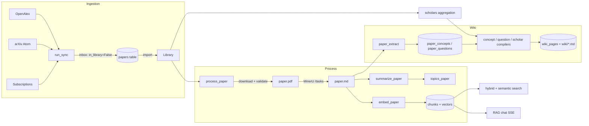

# Carrel wiki

[Carrel](https://github.com/) is a self-hosted, single-user paper reading
room. It pulls new papers from arXiv and OpenAlex (with Semantic Scholar
for citation data), normalizes and deduplicates them onto an OpenAlex Work
ID (arXiv id fallback), downloads OA PDFs, parses them to Markdown via a
self-hosted [MinerU](https://github.com/opendatalab/MinerU) service,
generates bilingual LLM summaries and topics, embeds chunks into pgvector
for hybrid + semantic search, and compiles an LLM wiki of scholar /
concept / question pages. One user, one machine, one Postgres.

This wiki is generated from source. Treat the code under `carrel/`,
`frontend/src/`, and `tests/` as authoritative; the pages below collect
the contracts, invariants, and workflows that span files.

## Runtime stack

- **Backend**: Python 3.11+, FastAPI, SQLModel (SQLAlchemy + Pydantic),
  APScheduler, httpx, litellm, pyalex, symspellpy, paramiko (optional).
- **Database**: PostgreSQL 16 + pgvector via Docker Compose; tests run
  against in-memory SQLite.
- **Frontend**: React 18 + Vite + TypeScript + Tailwind + shadcn-style
  UI; `react-markdown` with KaTeX for formulas.
- **External services**: arXiv Atom API, OpenAlex (via pyalex),
  Semantic Scholar Graph API, MinerU HTTP API, DeepSeek / Volcengine Ark
  (LLM + embeddings via litellm).
- **Storage**: `data/` on the local filesystem holds `config.yaml`,
  `papers/<id>/{paper.pdf,paper.md,images/}`, and `wiki/{concepts,
  scholars,questions}/*.md`.

## The end-to-end paper flow



Status values and owning transitions are documented on
[architecture/data-model.md](architecture/data-model.md) and
[ingestion/pdf-processing.md](ingestion/pdf-processing.md). Sync inbox
semantics are on [ingestion/sync.md](ingestion/sync.md).

## Where things live

| Area | Page |
|---|---|
| System architecture, runtime threads, request lifecycle | [architecture/overview.md](architecture/overview.md) |
| SQLModel tables, enums, ER diagram, Paper state machine | [architecture/data-model.md](architecture/data-model.md) |
| YAML + `.env` config, precedence, PATCH `/schedule` | [architecture/configuration.md](architecture/configuration.md) |
| APScheduler, `JOB_SPECS`, Job table, orphan reset | [architecture/scheduler-and-jobs.md](architecture/scheduler-and-jobs.md) |
| FastAPI app factory, lifespan, router order, static mount | [backend/app-lifecycle.md](backend/app-lifecycle.md) |
| Engine, `init_db`, additive migrations, HNSW indexes, wiki identity | [backend/database.md](backend/database.md) |
| Full HTTP route table and shared Job/BackgroundTask patterns | [backend/api-reference.md](backend/api-reference.md) |
| Papers list/filter/sort, inbox import/discard, delete, favorites/notes/tags | [backend/papers-and-library.md](backend/papers-and-library.md) |
| Scholars aggregation/cache, OpenAlex profile, works pagination | [backend/scholars.md](backend/scholars.md) |
| Multi-source search, RRF, semantic search, RAG chat SSE | [backend/search-and-chat.md](backend/search-and-chat.md) |
| Sync orchestration, cross-id dedup, placeholder promotion | [ingestion/sync.md](ingestion/sync.md) |
| arXiv / OpenAlex / S2 clients, normalize, merge | [ingestion/sources.md](ingestion/sources.md) |
| PDF download candidate order, MinerU, SSH fallback | [ingestion/pdf-processing.md](ingestion/pdf-processing.md) |
| arXiv → journal detection and safe PDF swap | [ingestion/publication-check.md](ingestion/publication-check.md) |
| LLM TL;DR / summary / keywords | [enrichment/summarization.md](enrichment/summarization.md) |
| LLM topic classification | [enrichment/topics.md](enrichment/topics.md) |
| Markdown chunker + pgvector embedding | [enrichment/embeddings.md](enrichment/embeddings.md) |
| Semantic Scholar citation/reference enrichment | [enrichment/citations.md](enrichment/citations.md) |
| Author A-ID backfill | [enrichment/authors-backfill.md](enrichment/authors-backfill.md) |
| Wiki layer overview, frontmatter, slugs, reindex | [wiki/overview.md](wiki/overview.md) |
| Scholar / concept / question compilers and batch stages | [wiki/compilers.md](wiki/compilers.md) |
| Per-paper LLM concept/question extraction | [wiki/paper-extract.md](wiki/paper-extract.md) |
| `entity_key`, redirects, reconciliation | [wiki/reconciliation.md](wiki/reconciliation.md) |
| Scholar alias detection and merge | [dedup/scholar-dedup.md](dedup/scholar-dedup.md) |
| Paper duplicate detection, LLM judge, user-state migration | [dedup/paper-dedup.md](dedup/paper-dedup.md) |
| Frontend routes, components, API client, Markdown rendering | [frontend/overview.md](frontend/overview.md) |
| Testing, Makefile, Docker Compose, ops scripts | [development/testing-and-deployment.md](development/testing-and-deployment.md) |

## Task-routing table

| Intent / change area | Owning source | Focused tests | Narrow validation |
|---|---|---|---|
| Add a metadata source or subscription kind | `carrel/sources/*.py`, `carrel/pipeline/runner.py`, `carrel/models.Subscription` | `tests/test_runner.py`, `tests/test_arxiv_search.py`, `tests/test_openalex_client.py`, `tests/test_s2_client.py` | `.venv/bin/python -m pytest tests/test_runner.py tests/test_normalize.py -q` |
| Change PDF download / MinerU parsing | `carrel/pipeline/process.py`, `carrel/sources/pdf_download.py`, `carrel/sources/mineru_client.py`, `carrel/sources/remote_downloader.py` | `tests/test_process.py`, `tests/test_process_api.py`, `tests/test_pdf_download.py`, `tests/test_mineru_client.py`, `tests/test_remote_downloader.py` | `.venv/bin/python -m pytest tests/test_process.py tests/test_pdf_download.py tests/test_mineru_client.py -q` |
| Change arXiv → journal detection | `carrel/pipeline/publication_check.py`, `carrel/api/publication.py` | `tests/test_publication_check.py`, `tests/test_publication_api.py` | `.venv/bin/python -m pytest tests/test_publication_check.py tests/test_publication_api.py -q` |
| Change LLM summary / chat prompts or models | `carrel/pipeline/summarize.py`, `carrel/api/chat.py`, `carrel/llm.py`, `cfg.llm.*` | `tests/test_summarize_pipeline.py`, `tests/test_summarize_api.py`, `tests/test_chat_history_api.py` | `.venv/bin/python -m pytest tests/test_summarize_pipeline.py tests/test_chat_history_api.py -q` |
| Change topic classification | `carrel/pipeline/topics.py`, `carrel/api/topics.py` | `tests/test_topics_pipeline.py`, `tests/test_topics_api.py` | `.venv/bin/python -m pytest tests/test_topics_pipeline.py tests/test_topics_api.py -q` |
| Change chunking / embedding dimension / index | `carrel/chunking.py`, `carrel/pipeline/embed.py`, `carrel/embeddings.py`, `carrel/models.VectorType/HalfvecType` | `tests/test_chunking.py`, `tests/test_embed_pipeline.py`, `tests/test_embeddings.py` | `.venv/bin/python -m pytest tests/test_chunking.py tests/test_embed_pipeline.py -q` |
| Change search ranking, RRF, field authority | `carrel/api/search.py`, `carrel/sources/merge.py` | `tests/test_search_api.py`, `tests/test_search_merge.py`, `tests/test_search_semantic.py` | `.venv/bin/python -m pytest tests/test_search_merge.py tests/test_search_semantic.py -q` |
| Change scholar aggregation or dedup | `carrel/pipeline/wiki/_scholars_agg.py`, `carrel/pipeline/scholar_dedup.py`, `carrel/api/scholars.py`, `carrel/api/scholar_dedup.py` | `tests/test_scholar_dedup.py`, `tests/test_scholar_works.py`, `tests/test_scholar_compile.py` | `.venv/bin/python -m pytest tests/test_scholar_dedup.py tests/test_scholar_works.py -q` |
| Change paper dedup / merge / aliases | `carrel/pipeline/paper_dedup*.py`, `carrel/pipeline/paper_dedup_ops.py`, `carrel/api/paper_dedup.py`, `scripts/migrate_paper_dedup.py` | `tests/test_paper_dedup*.py`, `tests/test_migrate_paper_dedup.py` | `.venv/bin/python -m pytest tests/test_paper_dedup.py tests/test_paper_dedup_ops.py tests/test_paper_dedup_judge.py -q` |
| Change wiki compilers or page format | `carrel/pipeline/wiki/*.py`, `carrel/pipeline/paper_extract.py`, `carrel/api/wiki.py` | `tests/test_wiki_*.py`, `tests/test_concept_compile.py`, `tests/test_question_compile.py`, `tests/test_scholar_compile.py`, `tests/test_paper_extract.py` | `.venv/bin/python -m pytest tests/test_wiki_reconcile.py tests/test_wiki_reindex.py tests/test_wiki_api.py -q` |
| Change a paper route, inbox, tags, notes | `carrel/api/papers.py`, `carrel/api/annotations.py` | `tests/test_inbox_api.py`, `tests/test_annotations_api.py`, `tests/test_api.py` | `.venv/bin/python -m pytest tests/test_inbox_api.py tests/test_annotations_api.py -q` |
| Change citation enrichment | `carrel/pipeline/citations.py`, `carrel/api/citations.py` | `tests/test_citations_api.py` | `.venv/bin/python -m pytest tests/test_citations_api.py -q` |
| Change schedule config or crons | `carrel/scheduler.py`, `carrel/api/schedule.py`, `carrel/config_store.py`, `cfg.schedule.*` | `tests/test_runner.py` (gating), manual `/schedule` PATCH | `.venv/bin/python -m pytest tests/test_api.py -q` then hit `GET /schedule` |
| Add a column / table / index | `carrel/models.py`, `carrel/db.py` (`_ensure_columns`, HNSW blocks, wiki-identity backfills) | `tests/test_api.py` (boot against SQLite), `tests/test_wiki_reconcile.py` | `.venv/bin/python -m pytest -q` (full suite runs on SQLite, no Docker) |
| Change a frontend page or component | `frontend/src/pages/*.tsx`, `frontend/src/components/*.tsx`, `frontend/src/api/client.ts` | TypeScript check only (`npm run lint` in `frontend/`); backend behavior covered by API tests | `cd frontend && npx tsc --noEmit` |
| Stand up a dev environment | `Makefile`, `docker-compose.yml`, `config.example.yaml`, `.env.example` | — | `make up && make install-backend && make backend`; `curl http://127.0.0.1:8787/health` |

## Run the test suite

```bash
.venv/bin/python -m pytest            # all tests on SQLite, no Docker
.venv/bin/ruff check carrel/ tests/   # lint
cd frontend && npx tsc --noEmit       # frontend type check
```

A live end-to-end smoke (Postgres + optional MinerU + LLM keys):

```bash
make up
make backend
curl -s -X POST http://127.0.0.1:8787/sync \
  -H 'content-type: application/json' \
  -d '{"lookback_hours": 72, "background": false}' | jq
```

## Scope and backlog

Per the repository README, milestones M1–M6 are complete; M7 polish
(favorites/tags/notes, citations/references, failure retries) has landed,
with manual PDF import still pending. The wiki covers every shipped
subsystem. Explicitly out of scope (and not documented beyond their
entrypoints):

- **Manual PDF upload** — UI/API not yet implemented; tracked as M7 work.
- **Alembic migrations** — `db.init_db` uses additive `_ensure_columns`
  for single-user installs. Alembic is listed in `pyproject.toml` but no
  migration versions are shipped; a future upgrade path is deferred.
- **BibTeX/RIS export** — referenced as "phase 2" in `PLAN.md`; not
  implemented.
- **Multi-user/auth** — explicitly a non-goal in `PLAN.md`. There is no
  `User` table and no auth middleware.

## Source of truth

- Code and tests are authoritative.
- [`README.md`](../README.md) tracks milestone status and quick-start.
- [`PLAN.md`](../PLAN.md) is the original Chinese-language product scope
  (non-goals, source strategy).
- [`docs/architecture.md`](../docs/architecture.md) is the original
  engineering blueprint; some directory names there predate the actual
  layout under `carrel/` — prefer the pages above when they disagree.
